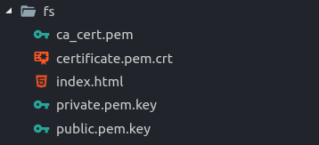

# AWS IoT Device

## Overview

This repo contains the device code running mongoose OS connecting to AWS mqtt server

## How the system works

The system works by having a function handles all the initial request and then forward it to the correct one based on the message types, for Alexa events, the children of the ParentHandler class are used to fulfill them

All handler are children of the ParentHandler class which declares a few abstract methods that the handler must implment to fit into the system, typically, when a request is passed onto a handler, its job is to act on the request, then compose a message appropriate to its type of namespace and then return the reply, which will be sent by the general handler function to the lambda function on aws cloud throught mqtt

The device_config.hpp files are used to let the general handler function know more about the system(like which mqtt channel to sub/pub to), the device_config also carry customized info like the pin numbers of control pin used by the handler, the device_config.hpp file also define a few macros that must be implemented to initialize the handler list that the user implemented

The format specifier to the aws iot reply is stored in the aws_iot_fmt.hpp in the based_framework folder since aws iot devices that implement the same endpoints share the same reply format

## Doxygen docs

[Base Framework Code](https://rawgit.com/khoitd1997/aws_iot_device/master/base_framework/docs/html/index.html)

[Bed Room Light Controller](https://rawgit.com/khoitd1997/aws_iot_device/master/bed_room_light_controller/docs/html/index.html)

[Pc Controller](https://rawgit.com/khoitd1997/aws_iot_device/master/pc_controller/docs/html/index.html)

## Backend of IoT

This project uses AWS lambda for triaging requests from Alexa, the essential detail of the request is passed onto the correct device thanks to a database corresponding between endpoint ID and the channel that the device pub/sub to

Replies from the devices are sent to the lambda function, then attched with more details to fit Alexa smart home json response format and then sent back to Alexa

The code for the lambda function backend is stored in another repo

## Device List

- pc Controller, used for turning on/off a computer
- Bed room light controller, used for turning on/off light
- Speaker Controller, used for controlling a regular amazon basic speaker

## Directory structure

**NOTE**: Some directories appear in the source code but are not present on github since they are sensitive files containing things like private key, wifi password, etc

### Repo directory structure

- based_framework/: this is the base code that all devices used, it manages all the handlers that the users register and is responsible for gluing together pieces of the project(like json parser, mqtt handler, aws command handler, etc)
- bed_room_light_controller/: contain code specific to the bed room light controller
- pc_controller/: contain code specific to the pc controller
- sample/: containing sample files with all senstive info redacted for example purpose
- system_info/: directory containg a shell script(named system_info.sh) that carry information about the internet system like wifi-ID and password
- utils_scripts: carry useful scripts that are not used too often, like creating keys for an aws device
- image/: contain pictures used for the README.md or other documentation

### Device code directory structure

All devices have a docs folder carrying their speciifc docs

#### based_framework code

- frozen/: json parser provided by Mongoose OS
- parent_handler/: contain the source files for the parent class that all handlers derived from
- base_system/: contain the master handler that is the glue for all pieces of the system

#### device specific handler code (like bed_room_light_controller or pc_controller)

- credentials/: folders containing a shell script(named mongoose_info.sh) that carry info like the arch of the mcu as well as its password and aws endpoints
- fs/: the filesystem folder, containg a dummy index.html file as well as certificates, private, public key, certificate of authorities

Most of the files in the fs/ dir are not on the public repo due to its sensitive nature, but yours should look like this(with file name matching the picture):



You can get those files by registering the devices on aws iot core console and download the file

**Special notes about the ca_cert.pem**: amazon will give you a list of certificates authorities files to download, just concatcenate all of them into one file and named it ca_cert.pem, the reason is that the server might choose a different ca_cert to talk with your devices so having all certs in one file make it harder to not have the correct certs, although if you are tight on memory, you might just need to find out which certs aws use consistently with your devices

## Shell scripts documentation

- device_init.sh: used for starting a new devices, will generate a basic file structure with some files alreayd filled in for you

To use it, launch the script with the folder name you want

```shell
./device_init pc_controller/
```

- mongoose_setup.sh: used for flashing and starting a console with a usb-connected iot devices, launch it with the directory name of the device code you want to flash

For example, to flash the connected device with pc_controller code:

```shell
./mongoose_setup.sh pc_controller/
```

- create_docs.sh: used to create doxygen docs, there is a list of folder that would be visited, add more if you have more devices, you need to have a doxyfile in the folder you want to generate docs for before running this command

```shell
create_docs.sh # use the Doxyfile in each project folder to generate docs
```

## Implementing a new aws devices

The code structure is designed to make implementing new devices as quickly as possible

For example, if we want to implement an iot device named pc_controller

```shell
./device_init pc_controller/ # create new device structure

#----------------------begin filling out info------------------------------
nano pc_controller/credentials/mongoose_info.sh # fill in devices info here

# then go to aws iot core to register your devices, and then download the public, private keys,
# the certificate and certificate authority to the fs folder of the device,
# name them respectively according to the picture above

# adjust mos.yml file according to your needs, remember to change things like device name,
# device ID, as well as the list of libraries you need
nano pc_controller/mos.yml

# change the macro based on your devices, specific documentation can be found in
# the example devices folder, but mainly you will need to implement how
# to initialize handler list and how to regsiter the interrupts you need(leave blank if you don't need any)
nano pc_controller/device_config.hpp

# Then start writing your handler classes, all handler classes must derive from the
# ParentHandler class found in the parent_handler folder in the based_framework folder,
# for implementation example, check the docs of the example devices implemented

#--------------------------Flashing and testing-----------------------------
./mongoose_setup.sh pc_controller/ # compile the code, flash it to devices and open a console to the device
```
